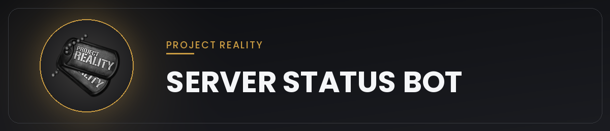

# 

## About
A fully automated, live-updating Discord bot designed for Project Reality communities. It fetches real-time server data and maintains a continuous dashboard in a specific Discord channel. It tracks server status, maps, and specific player lists (Admins/Friends) with high precision by combining direct network pings with official PRSPY data.

## How It Works
To ensure maximum accuracy and stability, this bot utilizes a dual-query system:
1. **Direct Server Query (GameDig):** Pings your PR server directly via the GameSpy4 protocol. This retrieves the live match data shown on the dashboard: current map, next map, mode, layer, factions, and total player count.
2. **PRSPY / Realitymod Server API:** Used to cross-reference your tracked **Admins** and **Friends** lists, matching their team assignment and Active/AFK status in the server.

## Features
- Live Updating Dashboard: The bot continuously edits a single message to avoid spamming the channel.
- Player Count & Factions: Displays the total number of active players and the current battling factions.
- Time Tracking: Displays the live round time by calculating server start delays. (Note: Due to server synchronization, the displayed time usually has an approximate 2-minute delay).
- Player Tracking: Separate lists to track when Admins and specific Friends/VIPs are online in the server, explicitly displaying which team they are currently playing on.
- AFK/Loading Detection: The bot intelligently detects if a tracked player is active or stuck in loading/AFK by checking if their in-game score, kills, and deaths remain at zero.
- Map Visuals: Automatically pulls the current map's layout from the official PR Map Gallery and displays it in the embed.
- Next Map Detection: Extracts the upcoming map directly from the server's sponsor text.
- Friend Join Alerts (Optional): Pings a role you choose, in a channel you choose, whenever a tracked Friend newly appears in the server.
- No-Admins Alert (Optional): Pings a role you choose, in a channel you choose, when the player count passes a threshold you set while none of your tracked Admins are in the server.

## Notifications (Optional)
Beyond the main dashboard, the bot can post two kinds of standalone alert messages, each in a channel of your choice and optionally pinging a role:

- **Friend Join Alerts:** Fires whenever one or more tracked Friends newly appear in the server, e.g. `Ezzeldin is online!` or `Ezzeldin, Komatsy, tarnished are online!`. The "already announced" list resets every new round, so everyone currently in the server gets announced again at the start of a fresh map.
- **No-Admins Alert:** Fires once when the player count reaches a threshold you set while none of your tracked Admins are in the server, e.g. `60 players online and no admins online!`. If the situation is still unresolved after a set amount of time (30 minutes by default, adjustable), it repeats the reminder. It stops repeating as soon as an Admin joins or the player count drops back below the threshold, and can fire again later if the situation returns.

Both are fully optional and independent of each other. Leave a notification's `channelId` empty in `config.json` to disable it completely. Leaving only `roleId` empty still sends the message, just without pinging anyone.

> **Tip:** For the role ping to actually notify people (not just show as plain text), make sure the bot has permission to mention roles in that channel, or enable "Allow anyone to @mention this role" in the role's Discord settings.

## Setup Guide

### Phase 1: Download the Files
Before starting, you need to download the bot files to your computer:
1. Scroll to the top of this GitHub page.
2. Click the green **Code** button.
3. Select **Download ZIP** and extract the files to a folder on your computer.

### Phase 2: Creating Your Discord Bot
1. Go to the Discord Developer Portal (https://discord.com/developers/applications).
2. Click "New Application" and give it a name.
3. On the left sidebar, click "Bot".
4. Under "Privileged Gateway Intents", enable "Server Members Intent" and "Message Content Intent".
5. Scroll down and click "Reset Token" to get your bot's token. Copy and save it safely.
6. Go to the "OAuth2" tab -> "URL Generator". Select "bot" and check the following permissions: "View Channels", "Send Messages", and "Manage Messages".
7. Copy the generated URL, paste it into your browser, and invite the bot to your server.

### Phase 3: Finding Your Server IP and API Name

**Finding the Server IP:**
1. Join your target server in-game.
2. Open Windows Task Manager -> go to the "Performance" tab -> click "Open Resource Monitor".
3. Navigate to the "Network" tab and look for the PRBF2.exe process under Network Activity to see active IP connections.
4. If multiple IP addresses appear, use **QuickDig UI** (https://quick-dig-ui.vercel.app) to confirm which one is correct. Enter the IP with Query Port `29900` and check that the server name and player list match your server.

**Finding the API Name:**
1. Go to PRSPY (https://prspy.realitymod.org).
2. Open the "PR:BF2 Servers" tab and find your server (use the Search button if needed). Its exact name is shown at the top of the panel once opened, e.g. `[ENG] Alliance EU | alliance-community.com`.
3. Copy this name exactly as displayed. This is your `apiName`.

### Phase 4: Free Hosting on Bot-Hosting.net
You can host this bot 100% free using Bot-Hosting.net:
1. Create an account on https://bot-hosting.net.
2. On the main dashboard, click the **"+ New"** button at the top right (or select **"New deployment"**).
3. Under the **01 Identity** section, enter a name for your bot.
4. Under the **02 Type** section, select **Application**.
5. Under the **03 Type** section, select **Blank**.
6. Under the **04 Type** section, select **Node.js** verstion 24.
7. Set **CPU** maximum.
8. Open your new project, go to the "Files" tab, and upload your extracted `index.js`, `config.json`, `package.json`, and `package-lock.json` files.
9. Dependencies (`discord.js`, `gamedig`) install automatically from `package.json` when the bot starts, no manual install command needed. If a dependency ever fails to load, check the "Packages" tab to confirm it's listed.

### Phase 5: Configuration & Startup
Now open `config.json` directly inside the "Files" tab on Bot-Hosting.net and update your details:

* `discord.token`: Paste the bot token you saved from Phase 2.
* `discord.channelId`: In Discord, enable "Developer Mode" (Settings -> Advanced), right-click your desired channel, and select "Copy Channel ID". Paste it here.
* `server.ip` & `server.port`: Enter your server's IP (from Phase 3) and Port (default PR port is 29900).
* `server.apiName`: Ensure this matches the server name exactly as it appears on PRSPY (from Phase 3).
* `adminsList` / `friendsList`: Add the exact in-game names to track. If you do not want to use these features, leave the brackets empty: `[]`
* `notifications.friends.channelId` / `notifications.friends.roleId`: Channel and role to ping for Friend Join Alerts (see [Notifications](#notifications-optional)). Optional, leave `channelId` empty to disable.
* `notifications.admins.channelId` / `notifications.admins.roleId` / `notifications.admins.playerThreshold` / `notifications.admins.repeatMinutes`: Channel, role, player-count threshold, and repeat interval for the No-Admins Alert. Optional, leave `channelId` empty to disable.

Save the file, go to the "Manage" tab, and click "Start". The bot will launch and start managing your live PR dashboard.

---

## Related Projects
- **[QuickDig UI](https://github.com/Suspect-404/QuickDig-UI)**: a free, open-source, login-free web tool by the same author for verifying a server's IP, Query Port, and live player roster. It's a lightweight companion tool, not a replacement for [PRSPY](https://prspy.realitymod.org), which remains the official PR:BF2 server/player browser.

---

## Screenshots

